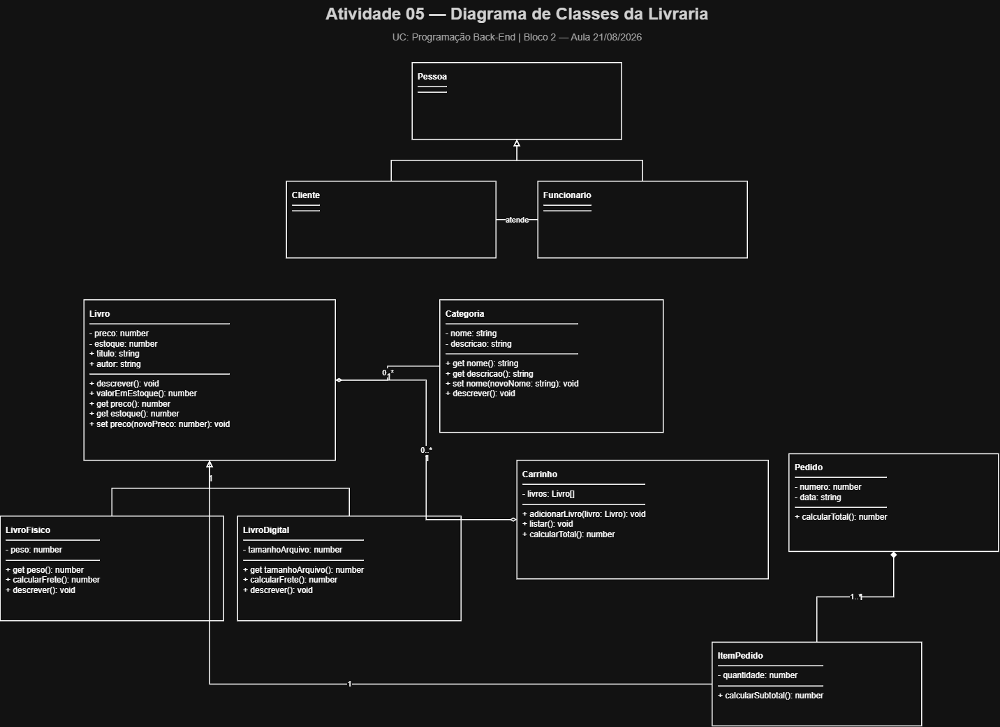

# API de Gestão da Livraria — Grupo 4

Projeto da UC de Programação Back-End — Curso Técnico em Desenvolvimento de Sistemas  
Escola SENAI "Santo Paschoal Crepaldi" — Turma 1-2026-SESI_DEV_OC_1

## Integrantes

- Vitor Hugo dos Santos Campos
- Guilherme de Souza Barbosa
- Isadora Costa Campanari
- Gabriel Nunes Lopes

## Atividade 09 — Entrega Consolidada do Bloco 2

Esta entrega consolida o diagrama UML, o esqueleto MVC, a aplicação dos critérios de Clean Code e a preparação do projeto para execução com Express.

## Diagrama UML final



O diagrama representa as classes do domínio e seus relacionamentos. Conforme solicitado na atividade, `Pedido` e `ItemPedido` permanecem somente no diagrama e ainda não possuem implementação em `src/models/`.

## Estrutura do projeto

```text
livraria-api-grupo4/
├── package.json
├── docs/
│   ├── diagrama-Classes.png
│   └── superpowers/
│       ├── specs/
│       └── plans/
├── src/
│   ├── index.js
│   ├── routes/
│   │   ├── livroRoutes.js
│   │   └── categoriaRoutes.js
│   ├── controllers/
│   │   ├── livroController.js
│   │   └── categoriaController.js
│   ├── services/
│   │   ├── livroService.js
│   │   └── categoriaService.js
│   └── models/
│       ├── Livro.js
│       ├── Categoria.js
│       ├── Pessoa.js
│       ├── Cliente.js
│       └── Funcionario.js
└── tests/
    ├── models.test.js
    └── services.test.js
```

### Função de cada camada

- **Routes:** recebem as requisições HTTP e encaminham para os controllers.
- **Controllers:** recebem a requisição, acionam o service correspondente e enviam a resposta.
- **Services:** concentram a lógica usada pelas rotas; nesta etapa utilizam estruturas simples em memória, sem banco de dados.
- **Models:** representam as entidades do domínio da livraria.

## Referências MVC implementadas

### Livro

```text
GET /livros
```

Fluxo:

```text
livroRoutes -> livroController -> livroService
```

### Categoria

```text
GET /categorias
```

Fluxo:

```text
categoriaRoutes -> categoriaController -> categoriaService
```

As duas rotas retornam listas em memória e funcionam apenas como referência do padrão MVC solicitado nesta etapa.

## Rotas gerais

```text
GET /
GET /sobre
```

Respostas esperadas:

- `/` — `API da Livraria no ar!`
- `/sobre` — `Livraria SENAI - Trabalho de PBE, turma 1-2026-SESI_DEV_OC_1`

## Clean Code — refatoração de 02/09

Em 02/09, o código foi refatorado com extração de constantes nomeadas e divisão de responsabilidades em métodos menores, reduzindo números mágicos e melhorando a legibilidade.

Principais ajustes consolidados nesta entrega:

- percentual de bônus e casas decimais extraídos para constantes nomeadas em `Funcionario.js`;
- porta padrão extraída para a constante `DEFAULT_PORT`;
- apresentação de `Pessoa` dividida nos métodos `exibirNome()`, `exibirEmail()` e `apresentar()`;
- apresentação específica de `Funcionario` separada em `exibirDadosProfissionais()`;
- arquivos de routes, controllers e services deixaram de ser placeholders vazios e passaram a formar um fluxo MVC executável.

## Como executar

```bash
npm install
npm run dev
```

O ponto de entrada da aplicação é `src/index.js`.

Depois, acesse:

- `http://localhost:3000`
- `http://localhost:3000/sobre`
- `http://localhost:3000/livros`
- `http://localhost:3000/categorias`

## Testes

O projeto usa o test runner nativo do Node.js, sem dependência adicional para testes.

```bash
npm test
```

## Checklist da Atividade 09

- [x] Diagrama UML referenciado na entrega
- [x] Models existentes com `module.exports`
- [x] `Pedido` e `ItemPedido` mantidos somente no UML
- [x] Estrutura `routes/`, `controllers/`, `services/` e `models/`
- [x] Referência MVC de Livro
- [x] Referência MVC de Categoria
- [x] Números mágicos substituídos por constantes nomeadas
- [x] Responsabilidades de métodos divididas em métodos menores
- [x] README atualizado com diagrama, estrutura e refatoração
- [x] Comandos de instalação, desenvolvimento e testes documentados

## Tecnologias

- Node.js
- npm
- Express
- Nodemon
- node:test
